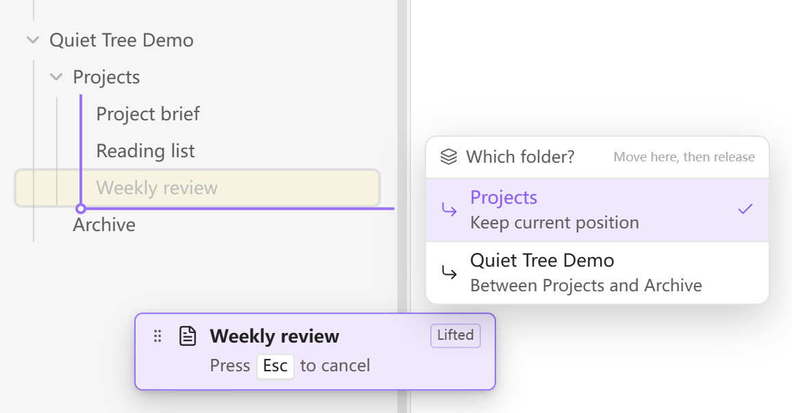

  

<h1 align="center">Quiet Tree</h1>

<strong>Your notes. Your order.</strong>

Drag and drop files and folders in Obsidian’s native file explorer.

  English · <a href="README.zh-CN.md">简体中文</a> 
  <a href="#features">Features</a> · <a href="#get-started">Get started</a> · <a href="#install">Install</a> · <a href="https://github.com/elfmedy/quiet-tree/issues">Feedback</a>

*See both the position and the destination folder before you drop.*

## Features

- **Arrange each folder your way.** Drag files and folders into a custom order without renaming them.
- **Choose exactly where to drop.** Position lines and a folder chooser make nested folder boundaries clear.
- **Keep the explorer you know.** Use Obsidian’s native file list and your theme. Choose whole-row dragging or a dedicated handle.
- **Use a mouse or touch.** Separate hold delays for desktop and mobile, with a cancel hint on desktop and a cancel area on touch screens.
- **Carry your order across devices.** Ordering travels with plugin settings when Obsidian Sync’s community plugin settings sync is enabled.

## Get started

1. **Hold** a file or folder to lift it. With a mouse, move slightly after holding.
2. **Move** to the position you want. At a folder boundary, choose the destination folder.
3. **Release** to drop. Change your mind? Press **Esc**, or drag into the touch cancel area.

Reordering within a folder changes only the saved order. Dropping into another folder **moves the file or folder**, with links handled by Obsidian.

## Install

In Obsidian, open **Settings → Community plugins → Browse**, search for **Quiet Tree**, then install and enable it. Use **Check for updates** there for future releases.

Beta testing and manual installation

- **BRAT:** add `elfmedy/quiet-tree` as a beta plugin.
- **Manual:** download `main.js`, `manifest.json`, and `styles.css` from [Releases](https://github.com/elfmedy/quiet-tree/releases/latest) into your vault’s `.obsidian/plugins/quiet-tree/` folder, then enable the plugin.

## Make it yours

Choose English or Chinese, whole-row or handle dragging, and your preferred hold delay. On desktop, you can exclude folders such as `assets`; mobile uses the same saved exclusions.

Settings and ordering live together in the plugin’s `data.json`. For sync setup, data recovery, and compatibility details, see the [usage and data guide (中文)](docs/guide.zh-CN.md).

See [Releases](https://github.com/elfmedy/quiet-tree/releases) for changes in each version. Touch behavior has been checked in mobile emulation; physical-device testing is still in progress.

---

[Report an issue](https://github.com/elfmedy/quiet-tree/issues) · [Development](docs/guide.zh-CN.md#development) · [MIT license](LICENSE)
